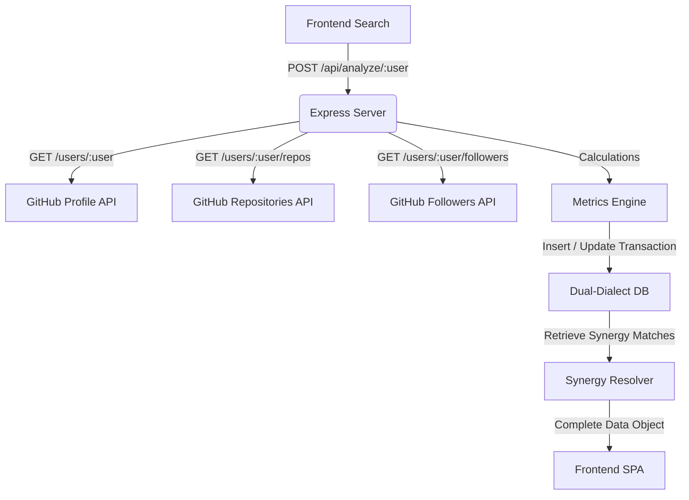

# RepoRadar - Core Architectural & Technical Specifications

This document provides a highly detailed explanation of the architecture, database configurations, metrics algorithms, canvas render loops, and API flows powering RepoRadar.

---

## 1. Deep Core Architecture

RepoRadar functions as an asynchronous data gathering and evaluation service. The data lifecycle is structured in a clear pipeline:



---

## 2. Dynamic DB Adapter & Schema Auto-Initialization

The platform abstracts database interaction via `db.js`. It utilizes the Connection String format to detect the active RDBMS on startup:

*   **Dialect Detection**: If the URI starts with `postgres://` or `postgresql://`, it instantiates a Serverless Postgres Connection Pool using `pg`. Otherwise, it instantiates a MySQL Connection Pool using `mysql2`.
*   **Automatic Sanitization**: Postgres uses parameter placeholders (`$1, $2`), while MySQL uses standard question marks (`?`). The query wrapper detects the dialect and translates all incoming placeholder structures dynamically:
    ```javascript
    if (isPostgres) {
      let index = 1;
      const pgText = text.replace(/\?/g, () => `$${index++}`);
      const res = await pool.query(pgText, params);
      return res.rows;
    }
    ```
*   **Schema Schema Auto-Creation**: Dynamically creates tables on startup:
    1.  `profiles`: Stores developer metadata, score, and alphanumeric grade.
    2.  `repositories`: Stores top 8 repositories, linked to the profile table via `FOREIGN KEY ... ON DELETE CASCADE`.
    3.  `languages`: Stores individual programming language usage percentages.

---

## 3. Metrics & Scoring Algorithm

The platform computes dynamic developer capacity vectors via a deterministic weighted formula:

### A. Raw Developer Score Formulation
$$\text{Developer Score} = (F_r \times 3) + (R_p \times 1) + (G_p \times 2) + (S_t \times 5) + (F_k \times 3) + B_c$$

Where:
*   $F_r$: Number of Followers.
*   $R_p$: Public Repositories count.
*   $G_p$: Public Gists count.
*   $S_t$: Total Stars accumulated across all repositories.
*   $F_k$: Total Forks accumulated across all repositories.
*   $B_c$: Profile Completeness Bonus points:
    *   `location` defined: $+10$
    *   `bio` defined: $+10$
    *   `company` defined: $+20$
    *   `blog` defined: $+10$

### B. Rating Scale
Alphanumeric grading bands partition developers into capability segments:
*   **S-Grade**: $\text{Score} \ge 1000$ (Elite open-source footprints)
*   **A+-Grade**: $500 \le \text{Score} < 1000$
*   **A-Grade**: $250 \le \text{Score} < 500$
*   **B+-Grade**: $100 \le \text{Score} < 250$
*   **B-Grade**: $50 \le \text{Score} < 100$
*   **C-Grade**: $\text{Score} < 50$ (Emerging developer)

---

## 4. Social Synergy Cluster Mapping

The synergy mapping maps developer connections across three direct database relationships:

1.  **Direct Follower Networks** (Weight: 150 points): Inspects if the target profile is a follower or followed by the analyzed profile.
2.  **Shared Repositories** (Weight: 100 points per match): Finds overlapping repository names, which implies direct co-contributions or identical forks.
3.  **Linguistic Profile Overlap** (Weight: 5 points per language): Maps matches in the languages tables.

These parameters are computed procedurally across other profiles in the database. The top three highest-scoring synergy developers are matched and served to the UI.

---

## 5. High-Performance Canvas Rendering & HiDPI scaling

To render crisp diagrams on all pixel-dense displays (Retina, 4K), standard canvas scaling is integrated:

### HiDPI Resolution Scaling
When rendering the Social Web Canvas, standard layout sizes cause fuzzy/blurry boundaries due to browser interpolation. The canvas solves this by scaling the coordinate grid:

```javascript
const dpr = window.devicePixelRatio || 1;
const rect = canvas.getBoundingClientRect();
canvas.width = Math.round(rect.width * dpr);
canvas.height = Math.round(rect.height * dpr);
ctx.setTransform(dpr, 0, 0, dpr, 0, 0);
```

### Canvas Animation Render Loop
An animation loop runs at screen refresh rate utilizing `requestAnimationFrame(draw)`. Each frame:
*   Redraws a semi-transparent background block `rgba(10, 11, 14, 0.2)` to create a tactical glowing trail sweep.
*   Paints concentric circular grids representing technological proximity.
*   Computes trigonometric angular vectors for peer nodes.
*   Draws visual connection paths from the developer center to matching synergy nodes.

---

## 6. REST API Reference & Payload Mechanics

RepoRadar exposes four highly optimized REST API endpoints to manage profile index states, pull GitHub metrics, compute social synergies on-demand, and retrieve granular database metadata.

### A. Analyze GitHub Profile
*   **Method / Endpoint**: `POST /api/analyze/:username`
*   **Purpose**: Orchestrates real-time API gathering, executes computational rating vectors, creates transactional records, and yields the final aggregate schema payload.
*   **Processing Pipeline**:
    1.  Hits `https://api.github.com/users/:username` to fetch primary user information.
    2.  Pulls the user's first $100$ public repositories (`/repos?per_page=100&sort=updated`).
    3.  Aggregates cumulative stars, forks, and aggregates project-wide programming languages byte sizes.
    4.  Runs the dynamic grading algorithm to output developer scores and grades.
    5.  Performs a transactional delete-then-insert cycle on `profiles`, `repositories`, and `languages` tables to keep database indexes current.
    6.  Computes matching synergy points on the fly with other indexed records in the DB.
*   **Sample Payload Schema**:
    ```json
    {
      "profile": {
        "id": 10,
        "username": "garv767",
        "name": "Garv",
        "avatar_url": "https://avatars.githubusercontent.com/u/1234?v=4",
        "bio": "Systems Engineer",
        "public_repos": 42,
        "public_gists": 3,
        "followers": 150,
        "following": 120,
        "location": "New Delhi, India",
        "company": "Educase",
        "blog": "https://garv.dev",
        "github_created_at": "2020-03-12T10:45:00Z",
        "developer_score": 1250,
        "developer_grade": "S"
      },
      "top_repositories": [
        {
          "name": "phishing-sentinel",
          "stars": 12,
          "forks": 5,
          "language": "JavaScript",
          "html_url": "https://github.com/garv767/phishing-sentinel"
        }
      ],
      "languages": [
        {
          "language": "JavaScript",
          "bytes_count": 8388608,
          "percentage": 100.00
        }
      ],
      "synergy_users": [
        {
          "id": 12,
          "username": "abhinandan-kp",
          "name": "Abhinandan",
          "developer_score": 350,
          "developer_grade": "A",
          "score": 350,
          "overlap_repos": ["phishing-sentinel"],
          "details": "Both worked/committed on identical repositories: phishing-sentinel. Direct follower/following overlap."
        }
      ]
    }
    ```

### B. List Indexed Profiles
*   **Method / Endpoint**: `GET /api/profiles`
*   **Purpose**: Retrieves basic metadata fields for all profiles saved in the database, automatically sorted by `developer_score DESC`.
*   **Query Operations**: Executes `SELECT * FROM profiles ORDER BY developer_score DESC` on the target database engine, delivering simple records to display the leaderboards and matrices.

### C. Retrieve Single Profile Details
*   **Method / Endpoint**: `GET /api/profiles/:username`
*   **Purpose**: Fetches cached profile data, repos, languages, and recalculated real-time database-wide synergy links without re-fetching external API records.
*   **Internal Actions**:
    1.  Loads profile by username from the `profiles` table.
    2.  Resolves associated tables via primary keys (`profile_id`).
    3.  Runs the synergy mapper dynamically on database profiles.
    4.  Delivers an identical schema format to the `POST /api/analyze/:username` payload.

### D. Delete Profile Index
*   **Method / Endpoint**: `DELETE /api/profiles/:username`
*   **Purpose**: Deletes the specified user profile index.
*   **Cascade Behavior**: Because the database schemas enforce `ON DELETE CASCADE` constraints on the foreign key references (`profile_id`) in `repositories` and `languages` child tables, deleting the parent record triggers automated cleaning in child tables without manual query logic.

